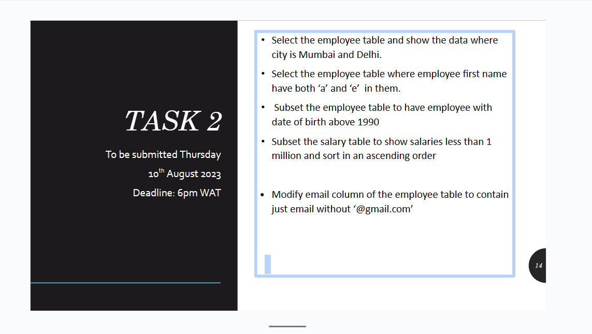
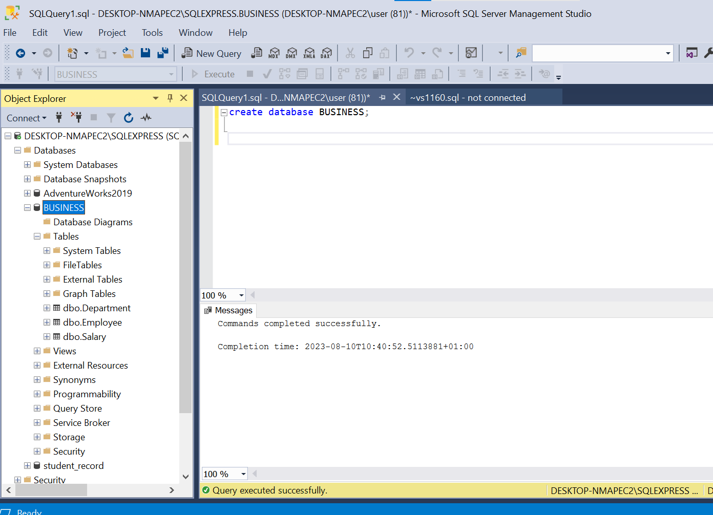
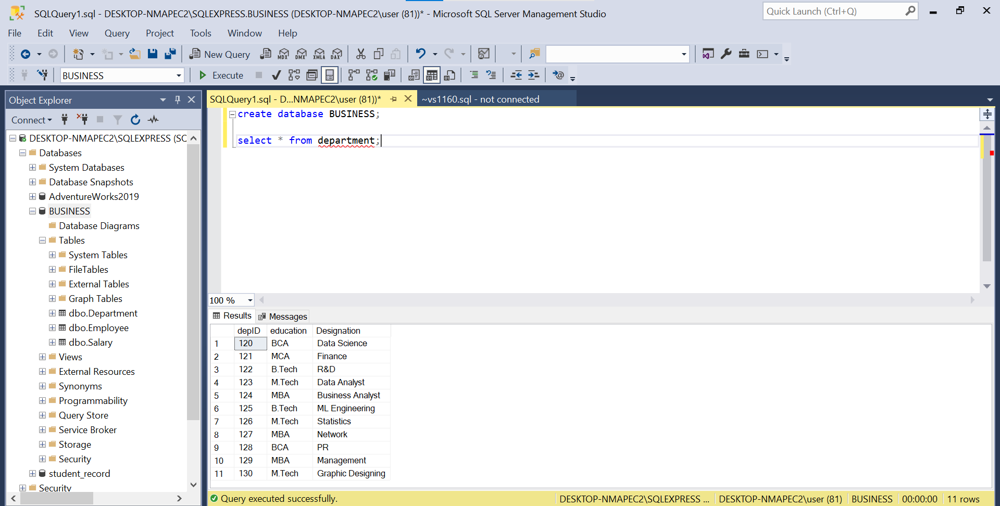
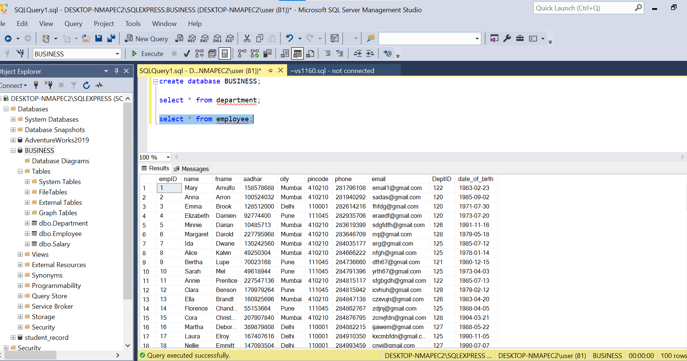
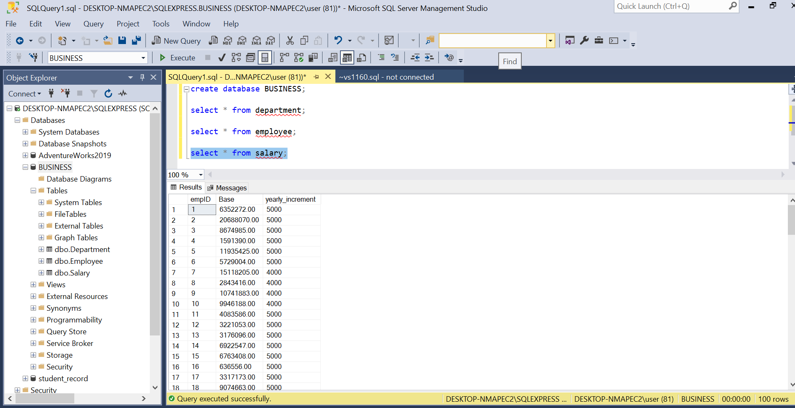
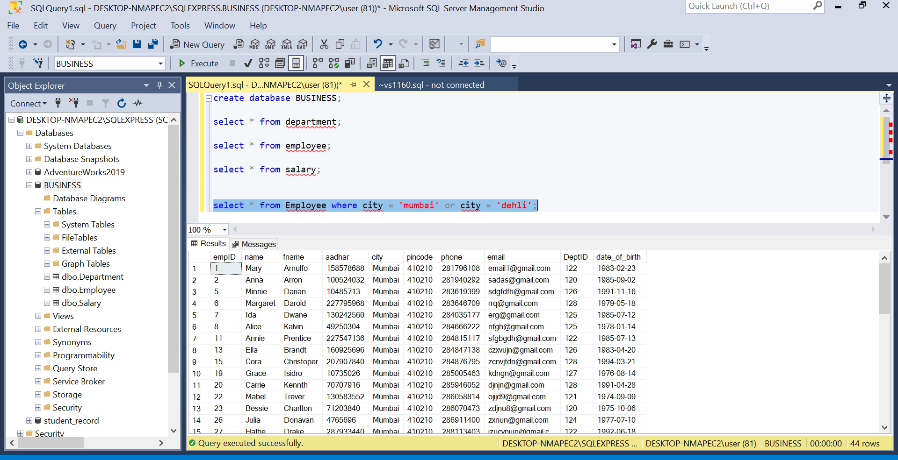
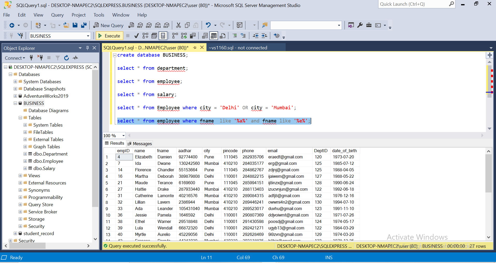
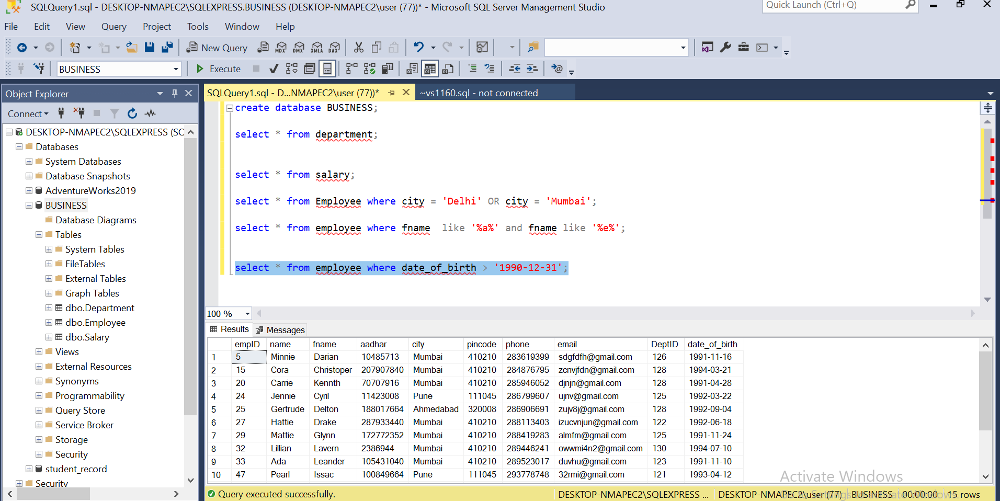
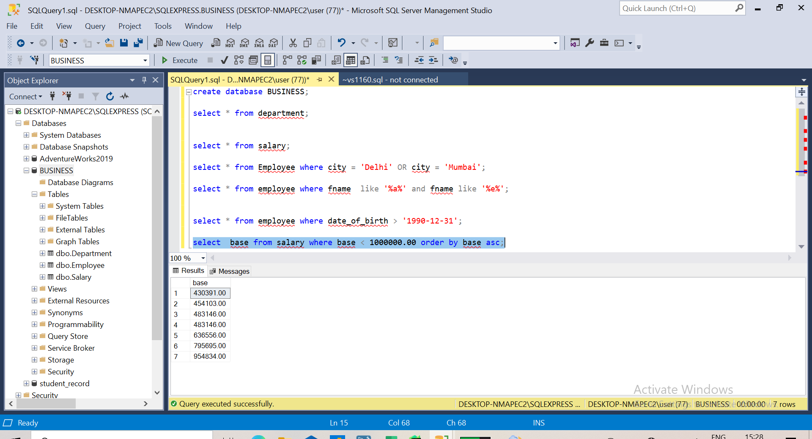

# SQL-TASK2

As i continue my journey and growth in SQL, i was given a second task with the question below

I started by creating a database and named it BUSINESS, then downloaded the set of tables that was provided to me into the database, so i downloaded the three tables (employee,salary,and, department)

you can see the three tables under the BUSINESS database at the object explorer.
after downloading the tables, this is how they all look.

##### Department Table

##### Employee Table

##### Salary Table

----
The first question was to show the data where city is Mumbai and Delhi in the employee table.

using the WHERE clause to filter, i used this syntax, select * from Employee where city = 'Delhi' OR city = 'Mumbai';

   
   
you can see the number of rows it returned, and if you check you can see it returned only the datas with mumbai and delhi

---
The second question is also about filtering, i was asked to call out the employees that have both 'a' and 'e' in their first name.
so it was easily solved using LIKE operator, (select * from employee where fname  like '%a%' and fname like '%e%';)

---

The  third question was to subset the employee table to have employee with data of birth above 1990.
using this syntax (select * from employee where date_of_birth > '1990-12-31';)

---

The fourth question was about subsetting and filtering the table to show salaries less than 1,000,000.00 and sort in and ascending order.
 using this syntax (select  base from salary where base < 1000000.00 order by base asc;)
 

 

